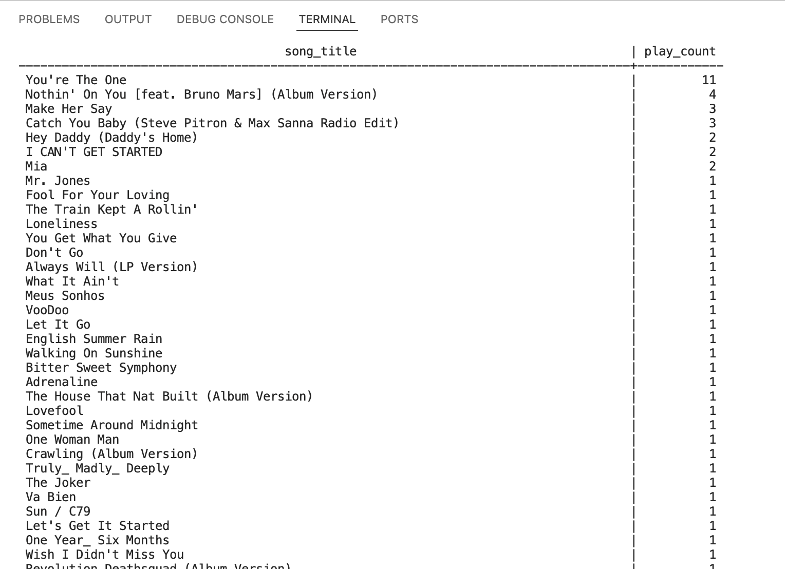
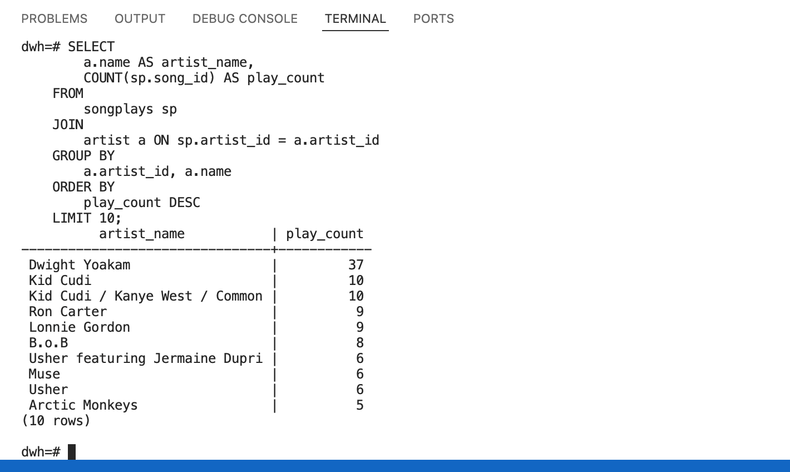

# Project Title
Cloud Data Warehouse ETL Pipeline

## Project Description
A music streaming startup, Sparkify, has grown their user base and song database and want to move their processes and data onto the cloud. Their data resides in S3, in a directory of JSON logs on user activity on the app, as well as a directory with JSON metadata on the songs in their app.

As their data engineer, you are tasked with building an ETL pipeline that extracts their data from S3, stages them in Redshift, and transforms data into a set of dimensional tables for their analytics team to continue finding insights into what songs their users are listening to.

This project implements an ETL pipeline that extracts data from S3, transforms it, and loads it into a Redshift data warehouse for analytics.

## Table of Contents
- [Usage](#usage)
- [Why the Star Schema Design](#why-the-star-schema-design)
- [ETL Process](#etl-process)
- [SQL Queries for Analytics](#sql-queries-for-analytics)
- [Analytical Examples Output](#analytical-examples-output)

## Usage
1. Set up infrastructure for the warehouse:
   ```bash
   python IaC_setup.py
2. Create table schema
   ```bash
   python create_tables.py
3. Run ETL pipeline to load data from S3 to staging tables on Redshift, then to analytics tables
   ```bash
   python etl.py
4. Run some analytical queries
   ```bash
   python analytics.py
5. Tear down infrastructure
   ```bash
   python IaC_teardown.py


## Why the Star Schema Design
1. Simplified Queries
Ease of use: The star schema simplifies complex queries by reducing the number of joins needed. This makes it easier for analysts to write and understand queries
Performance: Fewer joins lead to faster query performance, which is crucial for large datasets and real-time analytics
2. Data Redundancy
Denormalization: While star schemas are denormalized, this redundancy is intentional to improve read performance. It reduces the need for complex joins and speeds up data retrieval
3. Scalability
Handling large datasets: Star schemas are well-suited for handling large volumes of data, making them ideal for data warehousing environments
Incremental updates: They support incremental updates, which is beneficial for maintaining and updating data warehouses

## ETL Process
1. Data Integration
Combining data from multiple sources: ETL (Extract, Transform, Load) pipelines allow you to gather data from various sources, transform it into a consistent format, and load it into the star schema
Unified view: This integration provides a unified view of data, which is essential for comprehensive analysis and reporting
2. Data Quality and Consistency
Data cleansing: ETL processes include data cleansing steps to remove inconsistencies, duplicates, and errors, ensuring high-quality data in the star schema
Standardization: Transforming data into a standardized format improves data consistency and reliability
3. Automation and Efficiency
Automated workflows: ETL pipelines automate the process of data extraction, transformation, and loading, reducing manual effort and minimizing errors
Timely updates: Automated ETL processes ensure that the data warehouse is updated regularly, providing up-to-date information for decision-making
4. Scalability and Performance
Handling large volumes of data: ETL pipelines are designed to handle large datasets efficiently, making them suitable for the high data volumes typical in star schemas
Optimized performance: By pre-processing data before loading it into the star schema, ETL pipelines help optimize query performance and overall system efficiency

### In summary, a star schema design is ideal for data warehousing due to its simplicity, performance, and scalability. Building an ETL pipeline for it ensures data integration, quality, and efficient processing, making it a robust solution for business intelligence and analytics.

## SQL Queries for Analytics
1. Connect to the database
   ```bash
   psql -h dwhcluster.cjoyintr1svm.us-west-2.redshift.amazonaws.com -p 5439 -d dwh -U dwhuser
2. Query top 10 most listened artists
   ```bash
   SELECT 
        a.name AS artist_name,
        COUNT(sp.song_id) AS play_count
    FROM 
        songplays sp
    JOIN 
        artist a ON sp.artist_id = a.artist_id
    GROUP BY 
        a.artist_id, a.name
    ORDER BY 
        play_count DESC
    LIMIT 10;
3. Query most listened songs by male users in November
   ```bash
   SELECT 
        s.title AS song_title,
        COUNT(sp.songplay_id) AS play_count
    FROM 
        songplays sp
    JOIN 
        users u ON sp.user_id = u.user_id
    JOIN 
        song s ON sp.song_id = s.song_id
    WHERE 
        u.gender = 'M' 
        AND EXTRACT(MONTH FROM sp.start_time) = 11
    GROUP BY 
        s.title
    ORDER BY 
        play_count DESC;


## Analytical Examples Output
### Most listened songs by male users in November


### Top 10 most listened artists

